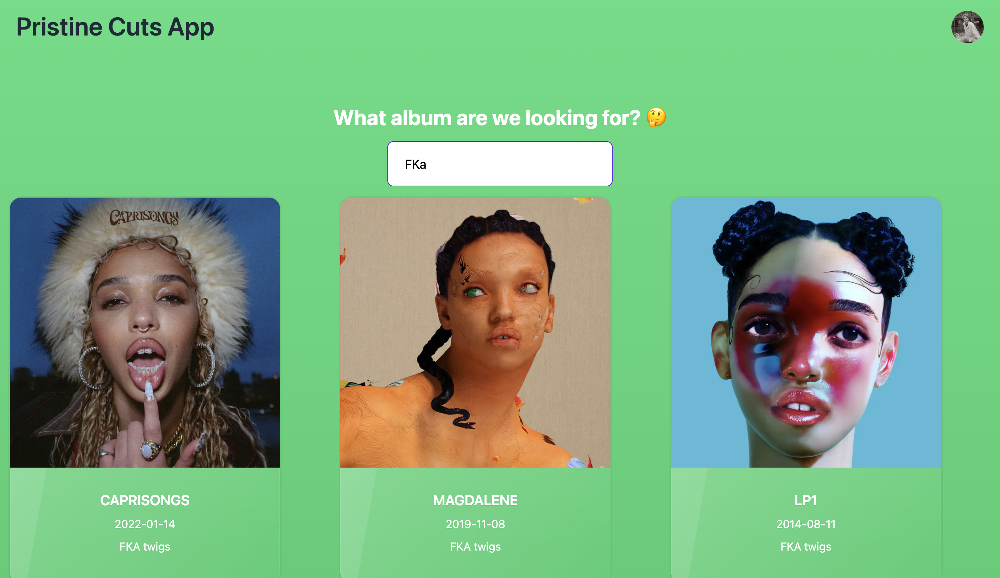

# Pristine Cuts

Since spotify has yet to extend quota you have to be approved to use this app. If you are interested in using this app please send me your email associated with the spotify account, here on Github or at [pawelpiwowarski2000@gmail.com](mailto:pawelpiwowarski2000@gmail.com), I will approve every request.

# Code Overview

This is a simple Typescript project I use NextJs for SSR, I also make use
of trpc for handling the typesafe API calls. Also I use tailwind for styling.
Spotify API is used for fetching data.

<figure>
  
  <figcaption>Main App Overview</figcaption>
</figure>
