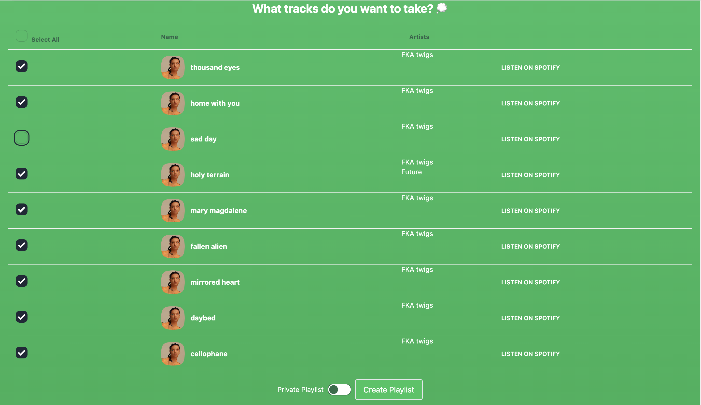

# Pristine Cuts - Spotify Data Viewer

If you are interested in using this app, please send me your email associated with the Spotify account either here on Github or at [pawelpiwowarski2000@gmail.com](mailto:pawelpiwowarski2000@gmail.com), and I will approve every request.

## Code Overview

Pristine Cuts is a simple TypeScript project built with Next.js for server-side rendering (SSR). The project utilizes trpc to handle typesafe API calls, and Tailwind CSS for styling. Data is fetched using the Spotify API.

### Main App Overview

  <figure style="text-align: center;">
    

  </figure>
 <figure style="text-align: center;">
    

  </figure>
   <figure style="text-align: center;">
    

  </figure>

